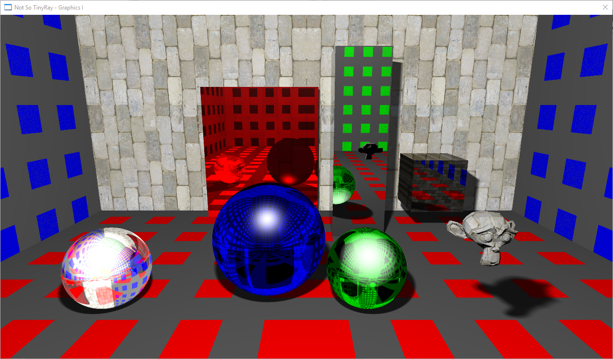

  

A CPU raytracer built as part of my Graphics I module.

Featrues:
Intersection of: Spheres, boxes, triangle meshes.
Reflections
Physically correct Refractions.
Soft Shadows
Texture & normal mapping.
Area Lights

